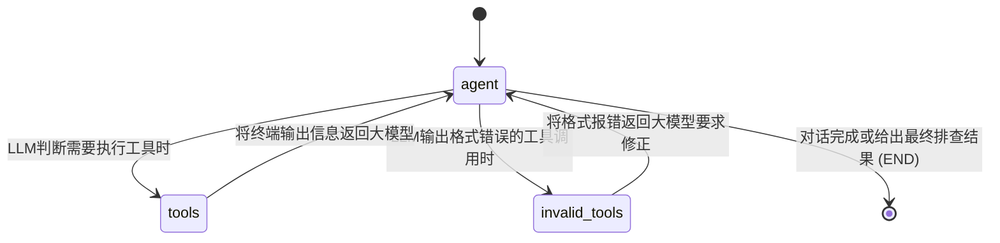

# Hardware Debugging Assistant (硬件调试 Agent)

这是一个基于 [LangGraph](https://langchain-ai.github.io/langgraph/) 和 **DeepSeek** 大模型的智能硬件调试助手。
用户可以通过自然语言描述他们遇到的硬件问题，Agent 将会自动连接至设备（支持 SSH 或串口），并在目标设备上执行命令、分析输出结果，从而帮助用户定位并解决问题。


## 功能特性

1. **自然语言交互**：只需告诉 Agent “我的网卡不见了”或“检查一下系统负载”，Agent 就会自动想办法帮你查找原因。
2. **多协议连接支持**：
   - **SSH**：支持用户名/密码，或基于 Key 的无密码登录。
   - **串口 (Serial)**：支持直接连接诸如 CH340, CP210x 等芯片的普通 COM 口。
3. **多会话真并发**：内置连接管理器，支持将 SSH/串口连接状态与 Web 会话 (Session) 绑定。Agent 任务是会话级后台任务，切走查看别的会话**不会中断**正在跑的任务——你可以同时让多个设备并行排错，随时切回去查看进度。侧边栏会显示哪些会话正在后台工作，切回来时自动回放你错过的命令输出与思考过程，连接互不串扰。
4. **自主决策能力**：借助于 LangGraph 的带有工具调用的状态图 (StateGraph)，Agent 会执行指令，获取输出；如果信息不足，会继续执行更多诊断命令（类似 ReAct 模式）。
5. **LLM 模型管理**：采用兼容 OpenAI 接口标准的大语言模型（如 DeepSeek、OpenAI 原生模型、Ollama 等）。默认行为为 `deepseek-chat`。
6. **智能密码交互逻辑**：当远端设备（SSH/串口）提示输入密码（如执行 `sudo` 等特权指令）时，Agent 的执行通道能够自动挂起并在本地控制台或网页端安全地请求用户输入密码，随后静默回传给设备。
7. **人工干预 (Human-in-the-loop)**：当命令卡在敏感词防火墙之外的交互提示（如 `conda install` 的 `[y]/n`、`apt` 的 `Y/n`、`fdisk` 的菜单选择，或任何未预料的卡死）时，Agent 会自动挂起并弹出干预窗口，把最近的终端输出交给你判断，由你决定发送什么输入、中止命令，还是继续等待。CLI 模式同样支持在本地终端交互。
8. **Token 预算驱动的上下文管理**：历史压缩不再按消息条数粗暴触发，而是依据大模型实际报告的 prompt token 用量——只有接近上下文窗口上限（默认 80%）时才压缩。压缩时优先保留原始目标与最近窗口、对冗长的命令输出做无损截断，仅在必要时对增量内容做摘要，杜绝「摘要套摘要」的信息衰减，大幅提升长会话质量。窗口大小可通过 `MODEL_CONTEXT_WINDOW` 环境变量配置。
9. **闭环指令验证**：约束模型在对系统进行状态更改（如安装软件、修改系统配置）后，强制去执行相关的二次验证操作（如检查进程状态或获取版本号），自动防范执行失败导致的伪成功反馈。
10. **高级 Web UI**：内置基于 FastAPI 和 WebSockets 的图形化页面，提供暗黑主题玻璃拟态界面、终端输出以及直观的思考过程展示；终端流会跨 chunk 执行退格/回车/ANSI 光标语义，进度条和 spinner 只保留最终状态，浏览器端还有节流与内容硬上限，内存压测不会因刷屏卡死页面。
11. **交互死锁防火墙**：在底层流处理与 Agent 认知级别双重设防，自动拦截或处理诸如 `htop`、`vim`、`less` 等会导致 PTY 终端永久挂起的命令。
12. **非法调用自我修正 (Self-Correction)**：新增对模型输出错误 JSON 或格式破坏的识别隔离节点 `invalid_tools`，原生捕获非法请求并流转回主代理，强制模型重新反思修正，彻底避免因上下文状态缺失导致的 API Error 400 中断异常。
13. **连接断线自动重连**：网络抖动、休眠或 WiFi 切换导致 WebSocket 断开时，前端会以指数退避自动重连并回放错过的输出。由于 Agent 任务运行在与连接解耦的后台，断线不会中断任何正在进行的诊断。
14. **会话导出**：任意会话可一键导出为 Markdown 调试报告（含命令、输出、结论与 token/成本统计），也可导出 JSON，便于团队分享与归档「上次是怎么修好的」。
15. **设备记忆 / 画像**：对同一台设备的身份信息（OS、内核、架构、CPU、内存、存储、网络）做持久化记忆。Agent 首次探明后会主动保存，后续会话直接复用，省去重复跑 uname/lscpu/free 的开销与 token。
16. **会话管理**：支持会话重命名与删除（悬停会话条目出现操作按钮），侧边栏不再随时间堆积成难以翻找的列表。
17. **成本可见**：每个会话实时统计累计 token 用量（输入/输出）与估算费用，按可配置的模型定价计算，在界面顶部以徽章展示，长会话的花费一目了然。
18. **文件传输**：内置 SFTP 文件上传/下载能力（`upload_file` / `download_file` 工具），支持推送固件镜像、配置脚本到设备，或把日志、dump 拉回本地分析。前端提供文件上传入口，上传后文件暂存并自动提示 agent 去推送。串口连接会明确告知不支持文件传输。
19. **重启并自动重连**：提供 `reboot_and_wait` 结构化动作——发 reboot 后自动等待设备回归并复用已存的连接凭据重连，重连后做一次存活探测确认主机响应。比裸跑 `reboot` 安全得多，后者会直接杀死会话让 agent 无法继续。串口设备会明确提示需手动重连。
20. **后台任务完成通知**：当一个会话的 Agent 任务在后台跑完时，通过浏览器原生通知 + 提示音提醒你（尤其是切到了别的标签页时），不必一直盯着页面。
21. **凭据保险库**：设备连接凭据以 AES-GCM 加密存储（密钥经 PBKDF2 派生），落盘文件不含任何明文密码。重启重连时自动从保险库解密取用，API 列表返回脱敏数据（只有元数据，无密文）。生产环境通过 `VAULT_MASTER_KEY` 环境变量固定密钥。
22. **不可篡改审计日志**：所有对设备执行的操作（连接、断开、每条命令及其退出码、连接失败）都写入 append-only 的 JSONL 审计日志，关联 session、设备、来源、时间戳。通过 `/api/audit` 可查询「谁在什么时候对哪台设备做了什么」，满足生产环境的可追溯与合规要求。
23. **健康检查端点**：新增 `GET /api/health`，供容器编排（K8s liveness/readiness）和反向代理探活使用。
24. **工业协议支持**：新增四条「无 shell 设备」的诊断通道——**SNMP**（交换机/路由器/PDU/UPS）、**Modbus**（PLC/传感器/电能表）、**Redfish**（现代服务器 BMC 带外管理）、**IPMI**（传统服务器 BMC）。Agent 会自动判断设备类型选择合适的协议工具，查询电源状态、传感器读数、接口流量、系统事件日志等，无需 SSH/串口。
25. **多设备批量编排**：支持定义设备组（device groups），对一组设备并发执行同一命令（`batch_run`），内置滚动分批与失败熔断保护——当一波设备失败率超阈值时自动中止后续，防止错误变更扩散。凭据自动从加密保险库解析。适用于「这 50 台机器都要升级内核」「这批交换机都要改 VLAN」等 fleet 级运维场景。
26. **配置漂移检测**：支持对设备的配置做时间点快照（`snapshot_config`），自动抓取 ip addr、iptables、路由、挂载、运行服务、SSH 配置等 11 项关键配置。之后用 `diff_config` 对比任意两次快照，精确显示哪些配置项发生了增删变化。排障「网络突然不通了」时，agent 能立刻定位是 iptables 策略变了还是 IP 被改了——把设备画像从「静态身份」升级成了「动态基线」。
27. **安全模式**：用户可在界面上一键切换安全模式。开启后，Agent 对任何修改系统状态的操作（安装软件、改配置、重启服务等）只提供命令建议和详细说明（做什么、为什么、风险），而不亲自执行——只读诊断不受限制。适合新手学习或谨慎操作场景。
28. **思考过程展示**：Agent 使用推理模型（如 GLM-5.2、DeepSeek-R1）时，思考过程（reasoning_content）会以可折叠面板展示，类似 DeepSeek 官方页面的体验。模型不支持时自动隐藏。
29. **自动案例生成 / 知识库**：每次 Agent 完成一个闭环调试会话后，后台自动从会话历史中提取结构化案例（症状 → 错误信息 → 前置条件 → 诊断 → 根因 → 解决方案 → 验证 → 回滚 → 风险 → Q&A），按领域分类存档为 Markdown 文件。每个案例包含 YAML frontmatter（tags + search_queries），为后续的向量检索和案例复用提供数据基础。
30. **外部 Agent API (OpenAPI)**：将全部 14 个设备操作能力以标准 RESTful API 暴露在 `/api/v1/tools/` 下，自动生成 OpenAPI 3.0 文档。外部 AI Agent（Dify、Coze、LangChain 等）导入 spec 后即可零代码调用 SSH、SNMP、Modbus、Redfish、IPMI、文件传输、重启重连、批量编排等全部能力——系统从「AI 助手」升级为「设备操作平台」。

---

## 技术架构说明

本项目的核心工作流通过 LangGraph 进行状态流转，结构大纲如下：



本系统主要利用如下技术栈：
- **LangChain/LangGraph**：用于定义包含状态、条件路由的工作流图，实现循环调用的 Agent。
- **paramiko**：用于通过 SSH 连接设备，包含通过 PTY 环境获取和发送控制台数据的轮询功能。
- **pyserial**：用于通过串口 (Serial) 读写设备。
- **langchain-openai**：由于 DeepSeek 官方兼容 OpenAI API 标准，因此可以直接利用该模块调用。

### 目录结构

```
ssh-helper/
├── agent.py           # LangGraph 状态图：Agent 节点、工具路由、安全模式指令
├── llm.py             # LLM 初始化（兼容 OpenAI/GDeepSeek/GLM，捕获 reasoning_content）
├── tools.py           # 14 个 Agent 工具：命令执行、文件传输、工业协议、批量编排、漂移检测
├── industrial.py      # 工业协议客户端：SNMP（纯 socket）/ Modbus / Redfish / IPMI
├── device_groups.py   # 设备组管理（批量编排的设备列表持久化）
├── baseline.py        # 配置基线快照与漂移对比
├── vault.py           # 凭据保险库（AES-GCM 加密存储）
├── audit.py           # 不可篡改审计日志（append-only JSONL）
├── case_generator.py  # 自动案例生成（从会话历史提取结构化知识库案例）
├── external_api.py    # 外部 Agent RESTful API（/api/v1/tools/，自动生成 OpenAPI 文档）
├── mcp_server.py      # MCP Server（将设备操作能力暴露为 MCP 工具，供 Codex/Claude/Cursor 等 AI 调用）
├── mcp_connections.py # MCP 持久连接注册表 + 非阻塞 PTY 命令运行器（connect 一次，run 多次）
├── scripts/           # 专用工具（按能力域和SoC分类：device/ mcp/ soc/，见 scripts/README.md）
├── web_server.py      # 【推荐】Web 服务端入口，WebSocket 人机交互 + REST API 挂载
├── static/            # 前端 Web UI 资源 (index.html, style.css, app.js)
├── main.py            # 【旧版】CLI 纯命令行终端交互入口
├── data/              # 运行时数据（会话/设备画像/保险库/审计/基线/案例，已 gitignore）
├── requirements.txt   # Python 依赖清单
├── .env.example       # 环境变量配置模板
└── README.md          # 帮助文档
```

---

## 快速运行

### 1. 安装依赖

确保你的 Python 环境是 `3.8+`，然后在项目根目录下运行：

```bash
pip install -r requirements.txt
```

### 2. 配置大模型 API

复制环境变量模板并填入你的 API Key：

```bash
cp .env.example .env
```

编辑 `.env` 文件，修改如下字段：
```env
OPENAI_API_KEY=your_actual_api_key_here
# 如果使用的是特定平台（如DeepSeek、Ollama），你可以取消注释并修改 BASE_URL 和 MODEL：
# OPENAI_BASE_URL=https://api.deepseek.com/v1
# OPENAI_MODEL=deepseek-chat

# 上下文窗口（按所用模型设置，影响历史压缩时机）：
# MODEL_CONTEXT_WINDOW=64000   # deepseek-chat
# MODEL_CONTEXT_WINDOW=128000  # gpt-4o / gpt-4.1
# MODEL_CONTEXT_WINDOW=200000  # claude / gemini
# MODEL_CONTEXT_BUDGET=0.8     # 达到窗口的多少比例时开始压缩（默认 0.8）

# 成本统计（token 始终统计，价格仅用于估算费用）：
# PRICE_INPUT_PER_1M=0.27       # 默认按 DeepSeek-chat cache-miss 计价
# PRICE_OUTPUT_PER_1M=1.10
# COST_CURRENCY=USD
```

### 3. 开始使用

你可以选择通过 **Web 可视化界面** 或者 **传统终端命令** 的方式启动助手。

#### 方案 A：Web 界面可视化调试（推荐 ✨）

运行 Web 服务：
```bash
python web_server.py
```
终端提示启动成功后，打开浏览器访问 👉 `http://localhost:8000/`

在页面左侧的侧边栏输入设备的 SSH 或 Serial 连接信息点击连接，然后在右侧输入你的硬件排错问题，例如：“网卡不见了，帮我查一下硬件层和驱动层的原因”。当碰到特权命令，页面中央会弹出输入密码的浮窗，输入即可放行指令。当命令卡在需要人工确认的交互提示（如 `conda`、`apt` 的 yes/no、`fdisk` 菜单等），会弹出干预窗口让你决定发送什么、中止还是继续等待。系统支持多会话真并发——每个会话的 Agent 任务都在后台独立运行，侧边栏会显示哪些会话正在工作，你可以放心切走去别的设备排错，随时切回来查看进度，错过的输出会自动回放。

#### 方案 B：传统 CLI 命令行模式

如果你偏好纯无头终端，可以直接运行：
```bash
python main.py
```
按照终端提示输入 `ssh root@192.168.1.50 22` 或 `serial COM3 115200` 即可连接并开始问答。

#### 方案 C：使用 Docker 部署运行（全平台支持）

本项目现已完美接入 Docker，支持通过 Github Actions 打包并推送到 DockerHub（同时兼容 `amd64` / `arm64` 架构）。这使得你在软路由、NAS、树莓派等设备上可以一键无缝部署。

1. **直接拉取并运行已有镜像**（请将 `<your_dockerhub_username>` 替换为实际拉取的用户名）：
```bash
docker run -d --name ssh-helper \
  -p 8000:8000 \
  -e OPENAI_API_KEY=your_super_secret_api_key_here \
  peweelive/sshhelper:latest
```
运行后访问：`http://localhost:8000/`

2. **如果需要使用本地串口 (Serial) 功能**：在启动时需要增加设备映射隧道 (`--device`)，以便让容器内部可以接触到底层宿主机的 USB 串口！举个例子（Linux宿主机下）：
```bash
docker run -d --name ssh-helper \
  -p 8000:8000 \
  -e OPENAI_API_KEY=your_key \
  --device=/dev/ttyUSB0 \
  peweelive/sshhelper:latest
```
*(注：由于 Docker 引擎的隔离限制机制，Windows系统运行的 Docker Desktop 不支持原生的串口/USB 透传。需要串口功能的 Windows 用户请参考 方案A 原生运行。)*

---

## 外部 Agent API

本系统不仅是一个人机交互的调试助手，还通过标准 RESTful API 将全部设备操作能力开放给外部 AI Agent 使用。

### 快速接入

1. **获取 OpenAPI 文档**：启动服务后访问 `http://localhost:8000/docs` 查看交互式 Swagger UI，或访问 `http://localhost:8000/openapi.json` 获取 OpenAPI 3.0 spec。
2. **导入到 Agent 平台**：将 OpenAPI spec 导入 Dify、Coze、LangChain 等平台，即可自动生成可调用的工具。
3. **直接调用**：任何能发 HTTP 请求的程序都可以直接调用 `/api/v1/tools/*` 端点。

### 可用端点

| 端点 | 功能 |
|------|------|
| `POST /api/v1/tools/execute` | SSH 执行 shell 命令 |
| `POST /api/v1/tools/snmp` | SNMP 查询网络设备 |
| `POST /api/v1/tools/modbus` | Modbus 读写 PLC / 传感器 |
| `POST /api/v1/tools/redfish` | Redfish 查询服务器 BMC |
| `POST /api/v1/tools/ipmi` | IPMI 查询传统服务器 BMC |
| `POST /api/v1/tools/upload` | SFTP 上传文件到设备 |
| `POST /api/v1/tools/download` | SFTP 从设备下载文件 |
| `POST /api/v1/tools/reboot` | 重启设备并自动重连 |
| `POST /api/v1/tools/batch-run` | 批量操作设备组（滚动 + 熔断） |
| `POST /api/v1/tools/snapshot` | 抓取配置基线快照 |
| `POST /api/v1/tools/diff` | 对比配置漂移 |
| `POST /api/v1/tools/search?q=` | 搜索知识库案例 |
| `GET /api/v1/tools/cases` | 列出全部案例 |
| `GET /api/v1/tools/devices/{key}/profile` | 查设备画像 |

凭据管理：如果不传 `password` 参数，API 会自动从加密保险库解析设备凭据。使用前先通过 `POST /api/vault/devices` 存入设备凭据。

### 调用示例

```bash
# 执行命令
curl -X POST http://localhost:8000/api/v1/tools/execute \
  -H "Content-Type: application/json" \
  -d '{"host": "192.168.1.10", "command": "uname -a"}'

# 查询 SNMP
curl -X POST http://localhost:8000/api/v1/tools/snmp \
  -H "Content-Type: application/json" \
  -d '{"host": "192.168.1.1", "oid_or_name": "sysDescr"}'

# 搜索知识库
curl -X POST "http://localhost:8000/api/v1/tools/search?q=ping%E4%B8%8D%E9%80%9A"
```

---

## MCP Server（AI Agent 原生接入）

除了 RESTful API，本项目还提供了标准的 [Model Context Protocol](https://modelcontextprotocol.io/) Server，并内置**持久连接工作流**：`connect()` 一次，之后 `run()` 连续执行任意多条命令，全部复用同一条 SSH 连接。这正是 Codex、Claude Desktop、Cursor 等 Agent 需要的「连接一次、多次操作」模型。

### 连接与命令模型

- 连接状态保存在 MCP Server 进程内（`mcp_connections.ConnectionRegistry`），跨 tool call 存活；stdio 模式下进程随客户端（Codex 等）启动和退出。
- `connect()` 默认从加密保险库取凭据（也可显式传 `password`），成功后自动开启 15s SSH keepalive，并执行一次 `uname -smr; hostname` 验证 exec 通道可用。
- `run()` 在 PTY 上执行命令：命令完成返回 exit status + 输出；超时返回部分输出和 `command_id`（用 `get_output()` 继续轮询，长命令不会被杀掉）；遇到 sudo 密码或 `[y/n]` 确认时返回 `awaiting_input`，问过用户后用 `send_input()` 回答（密码不会被 PTY 回显）。
- `htop/vim/nano` 等全屏交互命令会被共享安全防火墙直接拒绝，防止 PTY 死锁；同一连接同一时刻只允许一个活动命令。
- 所有命令照常写入 append-only 审计日志（`source=mcp`），与 Web/CLI 共用同一份追溯体系。

### 快速启动

```bash
# stdio 模式（默认，适用于 Codex / Claude Desktop / Cursor 等本地客户端）
python mcp_server.py

# HTTP 模式（默认只绑定 127.0.0.1:8787；确需远程访问再 --host 0.0.0.0）
python mcp_server.py --http --host 127.0.0.1 --port 8787
```

建议先通过 Web UI（`http://localhost:8000`）把开发板凭据存入加密保险库，MCP 端 `connect()` 留空 `password` 即可，密码不会出现在任何模型上下文或工具参数里。

### 在 Codex 中接入

编辑 Codex 配置（Windows：`C:\Users\<你>\.codex\config.toml`；Linux/macOS：`~/.codex/config.toml`）：

```toml
[mcp_servers.sshhelper]
command = 'C:\Users\<你>\.conda\envs\sshhelper\python.exe'
args = ['D:\path\to\sshhelper\mcp_server.py']
startup_timeout_sec = 60
```

重启 Codex 后直接说「连接我的开发板，然后依次跑 uname -a、uptime、free -m」，Codex 会自动调用 `connect` + 多次 `run`，全程复用同一条连接；每次工具调用仍会走 Codex 自己的审批界面。

### 在 Claude Desktop 中使用

编辑 Claude Desktop 的 `claude_desktop_config.json`：

```json
{
  "mcpServers": {
    "hardware-tools": {
      "command": "C:\\Users\\you\\.conda\\envs\\sshhelper\\python.exe",
      "args": ["D:\\path\\to\\sshhelper\\mcp_server.py"]
    }
  }
}
```

重启 Claude Desktop 后即可使用；MCP Server 是本地工具服务器，不需要配置任何 LLM API Key。

### 可用工具

**持久会话（推荐工作流）**：`connect` · `run` · `send_input` · `get_output` · `stop_command` · `status` · `disconnect` · `upload_file` · `download_file` · `reboot_device` · `snapshot_config` · `list_snapshots` · `get_snapshot`

**无状态 / 其他能力**：`execute_command`（一次性 SSH，适合未 connect 的任意主机）· `snmp_query` · `modbus_query` · `redfish_query` · `ipmi_query` · `batch_run` · `list_device_groups` · `diff_config` · `search_kb` · `get_device_profile` · `list_device_profiles`

交互链示例（sudo）：`run("apt update")` 返回 `[c3 awaiting_input hint=password]` → Agent 询问用户密码 → `send_input("<密码>")` → `get_output("c3", wait_seconds=10)` 拿到后续输出。

---

## ffmpeg-vpu（VPU 硬解版 ffmpeg，推流直播推荐）

Debian 的 ffmpeg 没有任何 CedarC/V4L2 解码后端，但 Allwinner 的 `libcedarc`（`libvdecoder`）是可直连的厂商原生接口。本仓库在 ffmpeg 7.1.5 源码级集成了 CedarC 解码器（`scripts/soc/allwinner-a733/ffmpeg/cedar_dec.c`），并在板子上构建为独立的 `/usr/local/bin/ffmpeg-vpu`，不覆盖系统 ffmpeg。

新增解码器：`h264_cedar`、`vp9_cedar`、`hevc_cedar`（HEVC 受限，见下）。

### 实测性能（1080p60 / 1080p30，10 秒测试流）

| 编码 | 软解 user CPU | VPU user CPU | 加速 |
|------|--------------|--------------|------|
| H.264 60fps | 8.5s | 1.3s | 6.7x |
| VP9 30fps | ~6.9s | 0.3s | ~22x |

端到端推流链路已验证：`VPU 解码 → x264 veryfast 6Mbps 重编码` 处理 1080p60 素材达到 **4.8 倍实时速度**（wall 12.8s 处理 10s 素材）；UDP MPEG-TS 实时直播闭环（`-re` 推流 8 秒、本机接收 471 帧 / 59.4fps）全部收齐。RTMP 推流直接用 `-f flv rtmp://...` 即可，FLV 容器输出已验证可正常回放。

### 使用示例

```bash
# VPU 纯解码基准
ffmpeg-vpu -benchmark -c:v h264_cedar -i input.mp4 -f null -

# 解码 + 转码推 RTMP（直播）
ffmpeg-vpu -re -c:v h264_cedar -i input.mp4 \
  -c:v libx264 -preset veryfast -b:v 4M \
  -f flv rtmp://your-server/live/streamkey
```

### 构建方法（在板子上）

```bash
sudo apt install -y build-essential nasm pkg-config libx264-dev
cd /tmp && curl -LO https://github.com/FFmpeg/FFmpeg/archive/refs/tags/n7.1.5.tar.gz && tar xzf n7.1.5.tar.gz && mv FFmpeg-n7.1.5 ffmpeg-n7.1.5
# 上传 scripts/soc/allwinner-a733/ffmpeg/cedar_dec.c 到 /tmp/ 后：
bash scripts/soc/allwinner-a733/ffmpeg/build.sh
sudo install -m 755 /tmp/ffmpeg-n7.1.5/ffmpeg /usr/local/bin/ffmpeg-vpu
```

### 已知限制

- `hevc_cedar` 默认禁用：这版 `libvdecoder` 的 HEVC 路径存在厂商级堆损坏 bug（官方 `vdecoderdemo` 同样崩溃）。设 `FFMPEG_VPU_HEVC=1` 可强制试开。
- 解码器关闭时会打印两条 `ion_alloc_vir2phy failed` 错误：厂商库 teardown 阶段清理内部指针导致，不影响解码结果与进程退出码。
- 文件末尾最后一帧在 EOS flush 中可能丢失（600 帧收 599），直播场景无影响。

---

## 扩展与自定义

- **增加工具**：如果你想赋予它更多的能力（如上传文件、特定脚本执行），只需在 `tools.py` 添加使用 `@tool` 装饰器的函数，并更新 `agent.py` 中的 `tools` 列表配置。
- **修改 Agent 行为**：修改 `agent.py` 中的 `SYSTEM_PROMPT`，你可以针对特定的开发板告诉它预先需要知道的特定指令。
- **增加外部 API 端点**：在 `external_api.py` 中添加新的路由即可扩展 `/api/v1/tools/` 下的能力，FastAPI 会自动更新 OpenAPI 文档。
- **自定义案例模板**：修改 `case_generator.py` 中的 prompt 和 `_case_to_markdown` 可以调整知识库案例的结构和内容。
